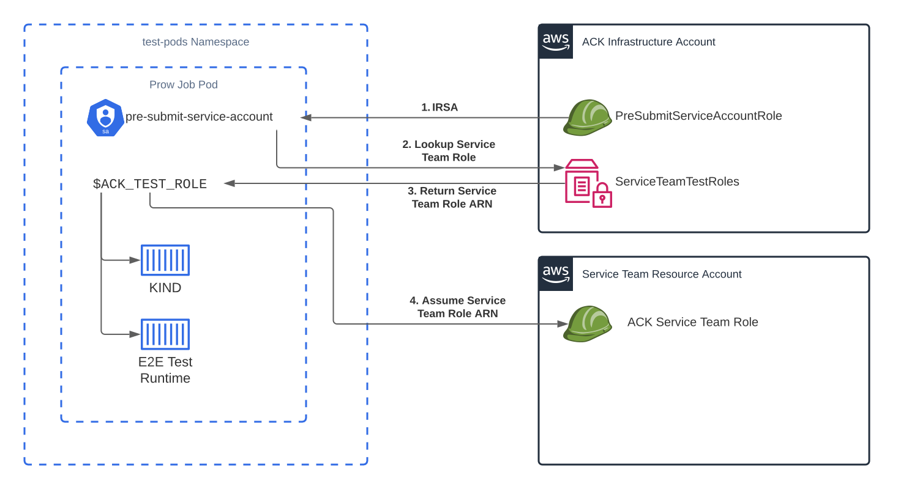

# IAM Structure

This document aims to outline each of the links in the chain of IAM roles that
are required for the testing infrastructure. We aim to only use short term
credentials, and reduce all policies to the minimum required for any given task.
All of the source code for deploying these roles is in the [`infra/`][infra]
directory.

[infra]: https://github.com/aws-controllers-k8s/test-infra/tree/main/infra

## Overview

Each Prow Job has an associated [Kubernetes Service Account (SA)][sa] that
describes the Kubernetes RBAC context within which the Prow Job's Pod executes.
Through [IRSA][irsa], this SA will be backed by an IAM role and the Pod will
subsequently be provided credentials. Next, the job entrypoint will look up an
[SSM parameter][ssm] with a path containing the given service e.g. `rds-role`.
Assuming that exists, it will then assume the role given as the value in that
parameter. From then on any actions will be authenticated against the service
team role.

[sa]: https://kubernetes.io/docs/tasks/configure-pod-container/configure-service-account/
[irsa]: https://docs.aws.amazon.com/eks/latest/userguide/iam-roles-for-service-accounts.html

## Service Account

We currently maintain two sets of Service Accounts, each associated with their
own IAM role.

One set is used for any post-submit jobs, and has privileges to push into
the production ECR repositories we use to host our container images and Helm
charts.

The other set is used for pre-submit jobs and has much more limited 
privileges. This role has permissions to read and write from the pre-submit S3
bucket - used for storing job results and metadata. More importantly, it has 
permissions to assume other roles (`sts:AssumeRole`). This Service Account is 
not meant to be used for testing, but only serves to initialize the Prow jobs 
and then assume a [service team testing role][service-role].

## SSM Parameters

The ACK core team maintains a set of [SSM parameters][ssm] that have [distinct 
paths for every service][ssm-paths]. As part of onboarding to Prow, service 
teams will [create a role][service-role] in their AWS account. This role is then
placed into the distinct SSM parameter as a `String` value.

The entrypoint [`wrapper.sh`][wrapper] script will attempt to look up the SSM
parameter as defined by the `SERVICE` environment variable. If no such parameter
exists the script will fail and the job will be aborted. If one is found, it 
will be assumed as the primary set of credentials for the container.

[ssm]: https://docs.aws.amazon.com/systems-manager/latest/userguide/systems-manager-parameter-store.html
[ssm-paths]: ./onboarding.md#c-notify-the-ack-core-team
[service-role]: #Service-Team-Role
[wrapper]: ../prow/jobs/images/wrapper.sh

## Service Team Role

Each ACK service team maintains their own IAM role in their own test resource
AWS account. This role grants access to any ACK Prow job, allowing it to create
resources on its behalf in the account. These resources include test 
bootstraps and resources created by an ACK controller during e2e tests.

More information regarding how to configure this role can be found in the 
[onboarding document][create-role-doc].

[create-role-doc]: ./onboarding.md#2-create-an-ack-test-role