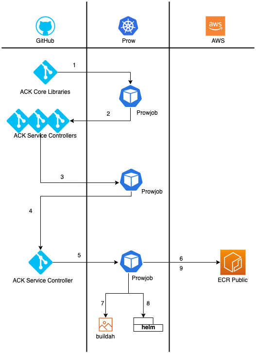

# ACK Prow Jobs

## Summary

ACK uses [Prow jobs][prow-jobs] to define the CI and CD system for each of the
service controllers and common repositories. All of the job specifications are
located in the `prow/jobs` directory of the `test-infra` repository. See the 
`README` within that directory for building the list of jobs.

We break down jobs into "presubmit", "postsubmit" and "periodic" types. 
"Presubmit" jobs must pass before a PR can be merged and are triggered by an 
`/ok-to-test` command in the PR comments. "Postsubmit" jobs are triggered by the
merging of a pull request and are typically used for publishing artifacts.
"Periodic" jobs run on a set interval and are currently not used by ACK.

The container images we use for Prow jobs are located in the `prow/jobs/images`
directory. For information about how to build and release new versions of these
images, refer to that `README` file.

To add any new repositories to the CI/CD system, see the `README` file in
`prow/jobs`.

## Presubmit Jobs

There are currently two sets of presubmit jobs:

### Unit tests

Unit tests runs each of the [Golang testing][golang-testing] files and reports
back on any errors.

[golang-testing]: https://golang.org/pkg/cmd/go/internal/test/

### Integration tests

Prow runs integration tests in the same manner as defined in the
[community testing documentation][testing-docs]. That is, each of the tests will
create a new KIND cluster, generate temporary credentials from a test IAM role 
and run the Python e2e tests against this cluster. However, because Prow jobs
run inside a Kubernetes cluster, we have to configure KIND and IAM especially to 
work inside a container environment.

[testing-docs]: https://aws-controllers-k8s.github.io/community/dev-docs/testing/

The Dockerfile we use for integration tests is
`prow/jobs/images/Dockerfile.test`. It includes all the command line tools 
required to run our bootstrapping and testing scripts. The image also includes a
full version of the Docker engine, which serves as the container runtime for
KIND and our Python e2e test container. The entrypoint for the image is a shell
script that optionally enables the Docker engine and assumes the appropriate
test role within the pod. For more information on the IAM pathway, see the
[iam-structure](iam-structure.md) document.

The Prow job configured for each service includes labels for enabling 
Docker-in-Docker support and to enable mounting the appropriate cgroup 
directories from the host instance (to support KIND clusters). It also ensures
that each job pod uses the `pre-submit-service-account` k8s service account, 
which has permissions to assume the test IAM role.

## Postsubmit Jobs

### Service Controller Generation
ACK uses postsubmit prowjobs to auto generate ACK service controllers when
a newer semver of ACK code-generator is released.
This postsubmit job does following 4 tasks: 
a) updates the go.mod file with latest ACK runtime dependency
b) generate ACK service controller with latest code-generator
c) generate release artifacts with next patch release version
d) open a pull request for service controller using `ack-bot` github account

### Service Controller Semver Tagging
Once an ACK service controller PR is merged, this prowjob checks the
release artifacts(/helm directory) to see if the semver version for controller
image in release artifacts is the next patch release of service controller.
If it is the next patch release, then the prowjob tags service controller repository
with semver of next patch release.

NOTE
```
Currently this prowjob only supports tagging the next patch release version.
Minor and Major release version tagging is not supported yet.
```

This prowjob works in conjunction with `Service Controller Generation` postsubmit
job to automate the release of service controller when a new semver of ACK 
code-generator is released.

NOTE:
```
This prowjob can also be used when manually releasing the next patch version of
service controller. Once the PR with newly generated release artifacts is merged,
this prowjob will create the new tag and new patch release.
```

### Publish Controller Image And Chart To ECR Public
This postsubmit prowjob runs whenever a new semver release of service controller
is published. This prowjob publishes latest release of service controller into
the [ECR public repository][ecr-repo] and into the [Helm chart repository][helm-repo].

The Dockerfile we use for continuous deployment is
`prow/jobs/images/Dockerfile.deploy`. It is based off `buildah`, which we use to
construct OCI-compliant images from inside the Prow container.

[prow-jobs]: https://github.com/kubernetes/test-infra/blob/master/config/jobs/README.md
[ecr-repo]: https://gallery.ecr.aws/aws-controllers-k8s/controller
[helm-repo]: https://gallery.ecr.aws/aws-controllers-k8s/chart

The diagram below will show how the postsubmit jobs help in making a new patch
release of service controller whenever there is a new release of ACK common runtime.



1. A new semver release of ACK common runtime triggers the prowjob to auto generate
service controllers.
2. The prowjob opens pull requests for all the successfully generated service
controllers. If any service controller fails to get generated, this prowjob
creates a GitHub issue for the same.
3. When the auto generated service controller PR gets merged, another prowjob is
launched
4. This prowjob creates a GitHub tag and GitHub release with next patch release
semver. Example: Create a tag 'v0.0.5' is last tag on repository was 'v0.0.4'
5. The new release triggers another postsubmit prowjob which is responsible for
publishing controller image and helm charts to public ECR repository.
6. Prowjob authenticates with public ECR registry
7. Prowjob build service controller image using `buildah` tool. `buildah` is preferred
to docker because it is lightweight tool compared to docker and does not need
access to docker engine or docker network bridge on the node for building controller
image.
8. Prowjob packages release artifacts into the helm chart.
9. Prowjob publishes controller image and helm chart in ECR public repositories.
